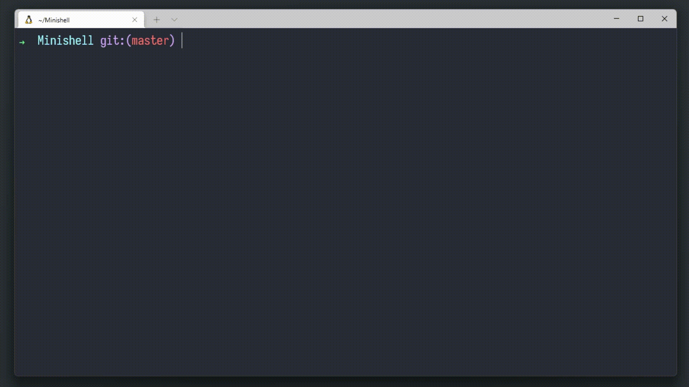

# Minishell

Minishell is the 8th project at [42](42sp.org.br). It tasks us to create a 'simple' [shell](https://en.wikipedia.org/wiki/Shell_(computing)). Yes, your little [bash](https://www.gnu.org/savannah-checkouts/gnu/bash/manual/bash.html) or [zsh](https://zsh.sourceforge.io/Doc/).

### Demo


### What is a shell?

Put simply, a shell is the outermost layer of communication between the user and operating system. Allowing us to navigate and execute tasks in human-readable language. If it breaks, you cannot talk anymore so it must be pretty reliable!

As part of the project we have implemented many features that are staple to linux shells. Those include running executables from absolute or relative path, like `/usr/bin/ls` or `ls`, which are fetched from the environment [PATH](https://en.wikipedia.org/wiki/PATH_(variable)). It handles pipe redirection with as many commands as needed. It supports usage of quotes and single quotes -- including nested ones -- and environment variable expansion. It handles specific signals like ``Ctrl-C`` ``Ctrl-\`` and ``Ctrl-D`` to quit the program, in the same way as bash.

A few of the functions are ["built-in"](https://whimsical.com/minishell-R7ozXMj4gLMiR1nmeYoxDY@VsSo8s35VFfYzEkkZTzB7Q), meaning we don't call the executable, but rather our own functions from inside the shell itself. It's the case for ``echo``, ``pwd``, ``cd``, ``env``, ``export``, ``unset`` and ``exit``. As part of the bonus, the operators ``&&``, ``||`` and the wildcard ``*`` are supported. We have also implemented extra functionality, zsh-like redirection that handles multiple files both as input or output.

### Application flow

We have created a schematic before beggining the project and updated it after completion. It shows you the broad strokes of the program and the files where you can find each feature.

Click [here](https://whimsical.com/minishell-R7ozXMj4gLMiR1nmeYoxDY@VsSo8s35VGGzFQLEo2WUD6) for the interactive link.

### What we learned

This is the first project in 42's cursus where we need to work in a group, getting closer to a real life professional experience. Throughout these 45 days we have learned much about unix, how to plan a project in advance, split tasks in a way that work can be done simultaneously in multiple sections, descriptive documentation, more specialized git tools, automated testing and much more!

### Badge


#### Our grade


## Getting started
**Follow the steps below**
```bash
# Requirements: GNU Readline Library
# To install the readline library, open the terminal window and write
sudo apt-get install libreadline-dev

# Clone the project and access the folder
git clone --recurse-submodules https://github.com/wwwwelton/minishell && cd minishell/

# Compile the program with
make

# Run the program
./minishell

# Write any shell command like
echo "hello minishell"

# Quit the program
exit

# Clean output objects with
make fclean

# Well done!
```

## Updating

The project is regularly updated with bug fixes and code optimization.

## 📝 License

This project is licensed under the GNU General Public License v3.0 - see the [LICENSE](license) file for details.

---

Made by:
João Rodriguez 👋 [See my Github](https://github.com/VLN37)<br />Welton Leite 👋 [See my linkedin](https://www.linkedin.com/in/welton-leite-b3492985/)
